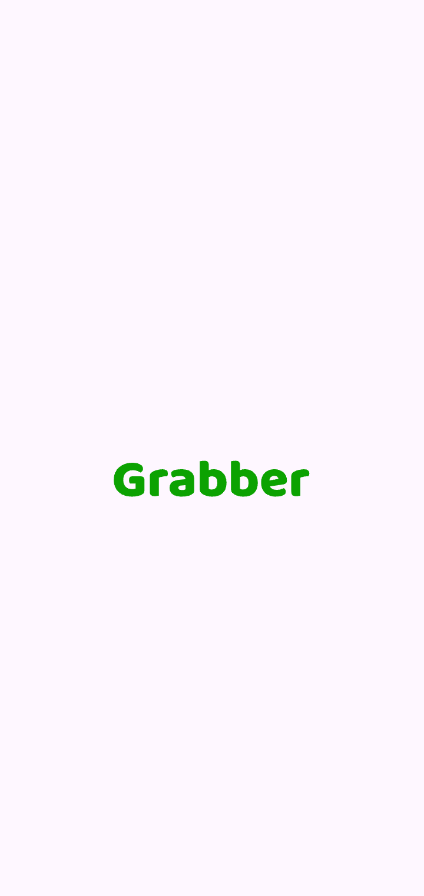
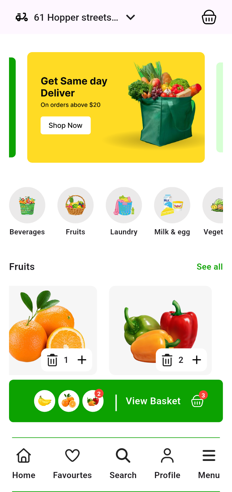

# Grocery Delivery App

A Flutter mobile application UI/UX demo for a grocery delivery service. This project showcases a modern, user-friendly interface for browsing products, managing a shopping basket, and navigating through different app sections.

---

## Overview

This project is a **UI/UX demonstration** of a grocery delivery mobile application built with Flutter. It provides a visual representation of how a grocery shopping experience could look and feel on mobile devices.

### What the project does

- Displays a splash screen on app launch
- Shows promotional banners with auto-play carousel
- Lists grocery categories for easy navigation
- Displays fruit products with ratings and pricing
- Allows users to add/remove items from a shopping basket
- Provides a bottom navigation bar for app sections

### Who it is for

- Flutter developers looking for UI/UX reference implementations
- Designers wanting to see Flutter widget implementations
- Students learning Flutter development
- Anyone interested in grocery delivery app interfaces

### Main goals

- Demonstrate clean, reusable widget architecture
- Showcase modern Flutter UI patterns
- Provide a foundation for building production grocery delivery apps

### Key capabilities

- Auto-playing promotional banner carousel
- Horizontal scrolling category and product lists
- Interactive shopping basket with item count badges
- Responsive bottom navigation bar
- SVG icon support for crisp graphics

---

## Features

### Splash Screen

- Animated logo display
- Automatic navigation to home screen after 3 seconds

### Home Screen

- **Delivery Location Header**
  - Motorcycle delivery icon
  - Location text display
  - Dropdown arrow indicator

- **Promotional Banners**
  - Auto-playing carousel slider
  - 3 promotional banner images
  - Smooth transition animations
  - Center page enlargement effect

- **Category Selection**
  - Horizontal scrolling category list
  - 5 grocery categories: Beverages, Fruits, Laundry, Milk & egg, Vegetable
  - Circular category icons with labels

- **Product Listing**
  - Horizontal scrolling fruit cards
  - Product image, name, rating, and price display
  - Add/remove items from basket functionality
  - Item count badge on product cards

- **Shopping Basket**
  - Fixed basket bar at bottom
  - Basket icon with item count badge
  - "View Basket" text label
  - Visual representation of items in basket
  - Badge showing total unique items

- **Bottom Navigation**
  - 5 navigation items: Home, Favourites, Search, Profile, Menu
  - Font Awesome icons
  - Clean, minimal design

---

## Tech Stack

| Technology | Details |
|------------|---------|
| **Framework** | Flutter |
| **Language** | Dart ^3.10.4 |
| **Architecture** | Widget-based UI (no formal architecture pattern) |
| **State Management** | StatefulWidget (setState) |
| **Routing** | Navigator.push (MaterialPageRoute) |
| **Dependency Injection** | Not implemented |
| **Networking** | Not implemented |
| **Local Database** | Not implemented |
| **Local Storage** | Not implemented |
| **Secure Storage** | Not implemented |
| **Authentication** | Not implemented |
| **Notifications** | Not implemented |
| **Firebase** | Not implemented |
| **Analytics** | Not implemented |
| **Code Generation** | Not implemented |
| **Testing** | Widget tests (flutter_test) |
| **CI/CD** | Not implemented |
| **Linting** | flutter_lints ^6.0.0 |

### Third-Party Packages

| Package | Version | Purpose |
|---------|---------|---------|
| `flutter_svg` | ^2.3.0 | SVG image rendering |
| `font_awesome_flutter` | ^11.0.0 | Icon library |
| `carousel_slider` | ^5.1.2 | Banner carousel |
| `cupertino_icons` | ^1.0.8 | iOS-style icons |

---

## Project Architecture

This project follows a **simple widget-based architecture** without formal design patterns like Clean Architecture or MVVM. The codebase is organized into:

### Layer Organization

- **UI Layer**: All widgets and screens in `lib/`
- **Data Layer**: Static data models and sample data in `lib/data.dart` and `lib/model.dart`
- **Utility Layer**: Theme colors and constants in `lib/utils/`

### Component Structure

- **Screens**: `spalsh.dart`, `home.dart`
- **Widgets**: Reusable UI components in `lib/widgets/`
- **Models**: Data classes in `lib/model.dart`
- **Data**: Static sample data in `lib/data.dart`
- **Utils**: Utility classes in `lib/utils/`

### State Management

Uses Flutter's built-in `StatefulWidget` with `setState()` for local state management. The shopping basket state is maintained in the `Home` widget's state.

---

## Project Structure

```
lib/
├── main.dart                 # App entry point
├── home.dart                 # Home screen with all UI components
├── spalsh.dart               # Splash screen (note: filename typo)
├── model.dart                # Data models (CategoryModel, fruitModel, EnumFruits)
├── data.dart                 # Static sample data for banners, categories, fruits
├── utils/
│   └── color_app.dart        # Color constants (primary, secondary, neutrals)
└── widgets/
    ├── badge_number.dart     # Badge widget for notification/item counts
    ├── banner_widget.dart    # Banner image widget
    ├── card_fruit_widget.dart # Fruit product card with add/remove controls
    ├── category_widget.dart  # Category selection widget
    └── fruit_image_widget.dart # Fruit image container widget

assets/
├── banners/                  # Promotional banner images (3 PNGs)
├── category/                 # Category icon images (5 PNGs)
├── fruits/                   # Fruit product images (3 PNGs)
├── icons/                    # SVG icons (basket, motorcycle)
├── logo/                     # App logo (SVG)
└── screen_shots/             # App screenshots (2 PNGs)

test/
└── widget_test.dart          # Default Flutter widget test

android/                      # Android platform configuration
web/                          # Web platform configuration (basic)
```

### Directory Responsibilities

- **lib/**: Contains all Dart source code for the application
- **lib/utils/**: Utility classes and constants (color themes)
- **lib/widgets/**: Reusable, self-contained UI components
- **assets/**: Static resources including images, icons, and screenshots
- **test/**: Widget tests for UI components
- **android/**: Android-specific build configuration
- **web/**: Web platform support files

---

## Prerequisites

- **Flutter SDK**: Version compatible with Dart ^3.10.4
- **Dart SDK**: ^3.10.4
- **Git**: For cloning the repository
- **IDE**: Android Studio, VS Code, or any Flutter-supported IDE
- **Android Studio** (for Android development)
- **Xcode** (for iOS development, if needed)

---

## Installation

### 1. Clone the repository

```bash
git clone https://github.com/alwhali/grocery-delivery-.git
cd grocery_delivery_app
```

### 2. Install dependencies

```bash
flutter pub get
```

### 3. Run the application

```bash
flutter run
```

---

## Build

### Android

```bash
flutter build apk
flutter build appbundle
```

### iOS

```bash
flutter build ios
```

### Web

```bash
flutter build web
```

### Windows

```bash
flutter build windows
```

### macOS

```bash
flutter build macos
```

### Linux

```bash
flutter build linux
```

---

## Configuration

### Environment Variables

No environment variables or `.env` files are currently implemented in this project.

### Firebase Setup

Firebase is not configured in this project.

### Build Flavors

No build flavors are configured.

### API Configuration

No API integration is implemented. The app uses static sample data.

### Secrets Management

No secrets management is required as this is a UI demo without backend integration.

---

## Usage

### Starting the Project

1. Run `flutter pub get` to install dependencies
2. Run `flutter run` to launch the app on an emulator or device
3. The app will display a splash screen for 3 seconds, then navigate to the home screen

### Adding a New Feature

1. Create a new widget in `lib/widgets/` if it's a reusable component
2. Add the widget to the appropriate screen in `lib/home.dart` or create a new screen
3. Update `lib/data.dart` if the feature requires new data
4. Add any new assets to the `assets/` directory and update `pubspec.yaml`

### Adding a New Screen

1. Create a new Dart file in `lib/` (e.g., `lib/new_screen.dart`)
2. Import the screen in `lib/main.dart` or use `Navigator.push()` from existing screens
3. Update the bottom navigation bar in `home.dart` to include navigation to the new screen

### Creating API Services

Currently, the app uses static data. To add API services:

1. Create a `lib/services/` directory
2. Add HTTP client code using `package:http` or similar
3. Create model classes with `fromJson()` methods
4. Replace static data in `lib/data.dart` with API calls

### Adding Localization

No localization is currently implemented. To add:

1. Create `lib/l10n/` directory
2. Add ARB files for each locale
3. Configure `flutter_localizations` in `pubspec.yaml`
4. Use `AppLocalizations` in widgets

### Adding Assets

1. Place images/icons in the appropriate `assets/` subdirectory
2. Update `pubspec.yaml` to include new asset paths
3. Use `Image.asset()` or `SvgPicture.asset()` in widgets

### Adding Dependencies

1. Add the package to `pubspec.yaml` under `dependencies` or `dev_dependencies`
2. Run `flutter pub get`
3. Import and use the package in your Dart files

---

## Data Storage

This project does not implement any persistent data storage. All data is static and loaded from `lib/data.dart`.

### Current Data Management

- **Static Data**: Product listings, categories, and banners are defined as static lists in `lib/data.dart`
- **In-Memory State**: Shopping basket state is maintained in the `Home` widget's state using a `Map<EnumFruits, int>`
- **No Persistence**: Basket data is lost when the app is closed

### Potential Storage Solutions (Not Implemented)

For production use, consider:
- **SharedPreferences**: For simple key-value storage
- **Hive**: For lightweight local database
- **SQLite/Drift**: For complex relational data
- **Firebase Firestore**: For cloud synchronization

---

## Assets

### Images

- **Banners** (`assets/banners/`): 3 promotional banner images (Slider1.png, Slider2.png, Slider3.png)
- **Categories** (`assets/category/`): 5 category icon images (Beverages, Fruits, Laundry, Milk & egg, Vegetable)
- **Fruits** (`assets/fruits/`): 3 fruit product images (banana, orange, pepper)
- **Screenshots** (`assets/screen_shots/`): 2 app screenshots (HomeScreen.png, SplashScreen.png)

### Icons

- **SVG Icons** (`assets/icons/`): 2 vector icons (basket.svg, motocycle.svg)
- **Font Awesome**: Used via `font_awesome_flutter` package for bottom navigation icons

### Logo

- **App Logo** (`assets/logo/`): 1 SVG logo file (logo.svg)

### Asset Organization

All assets are organized by type in dedicated subdirectories under `assets/`. Asset paths are registered in `pubspec.yaml`.

---

## Testing

### Test Framework

- **Framework**: flutter_test (built-in Flutter testing)
- **Current Tests**: 1 default widget test (does not match actual app functionality)

### Running Tests

```bash
# Run all tests
flutter test

# Run widget tests
flutter test test/widget_test.dart
```

### Test Coverage

The current test file contains the default Flutter counter test template, which does not reflect the actual app functionality. No custom tests have been implemented for the grocery delivery features.

### Recommended Tests to Add

- Widget tests for splash screen
- Widget tests for home screen components
- Widget tests for basket functionality
- Integration tests for user flows

---

## Code Quality

### Linting

- **Tool**: flutter_lints ^6.0.0
- **Configuration**: `analysis_options.yaml` includes recommended Flutter lints
- **Rules**: Default flutter_lints rules with no custom modifications

### Static Analysis

Run the analyzer to check for errors and warnings:

```bash
flutter analyze
```

### Formatting

Format code using Dart's built-in formatter:

```bash
dart format lib/ test/
```

### Recommended Development Workflow

1. Make code changes
2. Run `flutter analyze` to check for issues
3. Run `dart format` to format code
4. Run `flutter test` to ensure tests pass
5. Run `flutter run` to test on device/emulator

---

## Performance Notes

### Current Optimizations

- **Asset Management**: Images are loaded from assets with appropriate sizing
- **ListView.builder**: Used for horizontal scrolling lists to enable lazy loading
- **Carousel Slider**: Efficient banner carousel with auto-play
- **SVG Icons**: Vector graphics for crisp display at any size

### Potential Optimizations

- **Image Caching**: Implement `cached_network_image` for network images
- **Lazy Loading**: Already implemented via ListView.builder
- **State Management**: Consider implementing a more efficient state management solution for larger apps
- **Code Splitting**: Not applicable for this small demo app

---

## Screenshots

The repository includes app screenshots in `assets/screen_shots/`:

- **SplashScreen.png**: Splash screen with logo
- **HomeScreen.png**: Home screen with banners, categories, and products




---

## Known Limitations

- **Filename Typo**: `lib/spalsh.dart` contains a typo (should be `splash.dart`)
- **Syntax Error**: `lib/main.dart` line 34 has invalid syntax: `colorScheme: .fromSeed(seedColor: Colors.deepPurple),` (missing `ColorScheme`)
- **Default Test**: `test/widget_test.dart` contains the default Flutter counter test, which does not match the actual app functionality
- **No State Management**: Uses basic `setState()` without a formal state management solution
- **No Persistence**: Shopping basket data is not persisted between app sessions
- **No Navigation**: Bottom navigation items have empty `onTap` callbacks
- **No Backend**: All data is static; no API integration
- **Limited Platforms**: Only Android and Web are configured; iOS, Windows, macOS, and Linux configurations are minimal or absent
- **No Authentication**: No user authentication or profile management
- **No Localization**: App is not localized for multiple languages
- **No Error Handling**: No error handling or loading states implemented

---

## Contributing

This project is open for contributions. To contribute:

### Workflow

1. **Fork** the repository
2. **Create a branch** for your feature or bugfix:
   ```bash
   git checkout -b feature/your-feature-name
   ```
3. **Make changes** and ensure code quality:
   ```bash
   flutter analyze
   dart format lib/ test/
   flutter test
   ```
4. **Commit** your changes with a clear message:
   ```bash
   git commit -m "Add: description of your changes"
   ```
5. **Push** to your fork:
   ```bash
   git push origin feature/your-feature-name
   ```
6. **Create a Pull Request** on GitHub with a description of your changes

### Code Standards

- Follow Flutter and Dart style guidelines
- Use meaningful variable and function names
- Add comments for complex logic
- Ensure all widgets are reusable where possible
- Test your changes before submitting

---

## License

This project currently has no LICENSE file.

---

## Acknowledgments

- **Flutter**: Open-source UI toolkit by Google
- **Font Awesome**: Icon library via `font_awesome_flutter` package
- **flutter_svg**: SVG rendering support
- **carousel_slider**: Carousel/banner slider functionality
- **Flutter Community**: For packages and documentation

---

## Contact

For questions or feedback about this project, please visit the [GitHub repository](https://github.com/alwhali/grocery-delivery-).